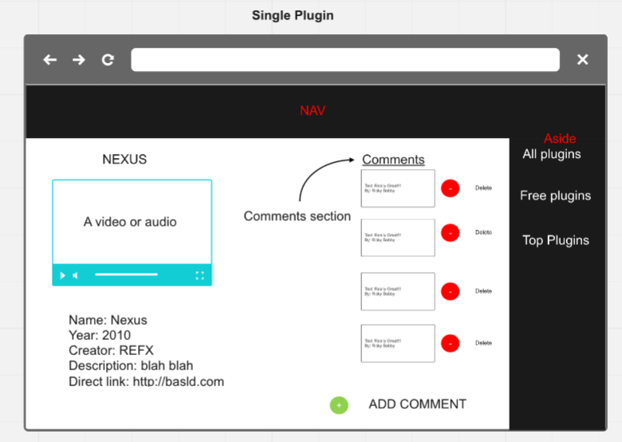
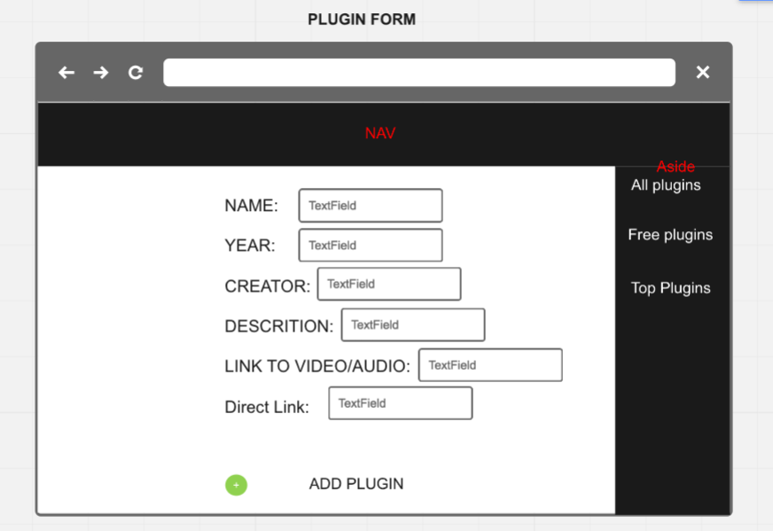

# Final Project Music 
### User Story 

### Index

#### When the page loads, the user will see a welcome hero, a nav bar, and a menu of different plugins lists; free plugins, top plugins, and all plugin

### Plugin List

#### When the user clicks the a category, they will be presented a list of plugins with some information about it and a image.

### Single Plugin

#### When the user clicks a plugin, they will come to a page with a video or audio link of the plugin in use. Also information about the plugin and a link to the plugin it self. There will be a comment section. 

### Add

#### When a user clicks the add button, they will be brought to a add form.

### Plugin Form

#### The user can enter in the data for name, year, creator, a description, video/audio link, and direct Link.

### Add comment

#### When a user clicks the add button, they will be brought to a comment form.

### Comment Form

#### The user can enter their name and comment

